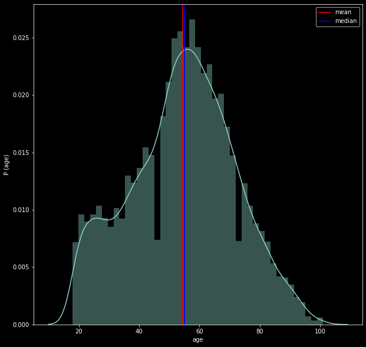
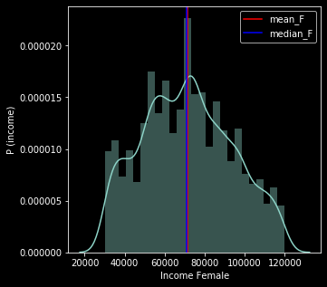

# Project: Starbucks Purchasing Decision Analyzer

## Table of Content

- [Project Overview](#overview)
- [Problem statement](#problem)
- [Run the Project](#run)
  - [Access the data](#access)
  - [Data Cleaning](#cleaning)
- [File Structure](#files)
- [Software Requirements](#sw_requirements)
- [Conclusion](#conclusion)

## 1. Project Overview

This data analytics project is part of the Udacity Data Science Nano Degree (DSND) program. This data set contains data that mimics customer behavior on the Starbucks rewards mobile app. Once every few days, Starbucks sends out an offer to users of the mobile app.
An offer can be merely an advertisement for a drink or an actual offer such as a discount or BOGO (buy one get one free). Some users might not receive any offer during certain weeks.

## 2. Problem statement

Not all users receive the same offer at the same time - and exactly that is the challenge to solve with this three data sets.

Dataset "profile.json" - contains customer demographic data including their age, gender, income, and when they created an account on the Starbucks rewards mobile application

Dataset "portfolio.json" - this file describes the characteristics of each offer, including its duration and the amount a customer needs to spend to complete (difficulty)

Dataset "transcript.json" - describes customer purchases and offers received, viewed, and completed

With the data from this dataset, we will create a detailed analysis of the customers and link them to the offers and transactions.
The aim is to find out which potential customers should be addressed best by Starbucks.

## 3. Run the Project

The program for accessing the data, cleaning and analyzing the data is written in a Python Jypyter notebook.

### 3.1. Access to the data

1. Download the zip file "data.zip" from the /data folder
2. Unzip the zip file and save it in a /data directory
3. Download the file with the extension * .ipynb
4. Start the * .ipynb in Python from root folder
5. Follow the program code and comments

### 3.2. Data cleaning

Before we can start with the Exploratory Data Analysis (EDA), the dataset still needs to be cleaned.
The cleaning of the data is documented directly in the program code and was carried out in three phases.

## 4. File Structure

<pre>
.
├── data
│   ├── portfolio.json---------------------------------------# ORIGINAL DATA FILE
│   ├── profile.json-----------------------------------------# ORIGINAL DATA FILE
│   ├── data_all.csv.zip-------------------------------------# OUTPUT FILE AFTER DATA CLEANING
│   ├── data.zip---------------------------------------------# ALL INPUT DATA AS ZIP
├── graphs---------------------------------------------------# GRAPHS FROM PROGRAM CODE
├── screenshots----------------------------------------------# PLOTS and SCREENSHOTS
├──starbucks_purchasing_decision_analyzer.ipynb--------------# PROGRAM CODE IN JUPYTER NOTEBOOK
├──starbucks_purchasing_decision_analyzer.html---------------# PROGRAM CODE in HTML
│
</pre>

## 5. Software Requirements

The project uses **Python 3.7** and additional libraries: 
- _pandas_
- _numpy_ 
- _sys_
- _time_
- _collections_
- _json_
- _re_
- _plotly_
- _scikit-learn_

## 6. Conclusion

The problem that we chose to solve was to understand the customer of the Starbucks rewards mobile application better.
We also wanted to develop insights from the three data sets, which we can only obtain through a combination of the three data sets.

Here some insights from the graphs out of the program code: 

**_Graph 1_**

**_Graph 2_**

**_Graph 3_**

**_Graph 4_**

**_Graph 5_**

**_Graph 6_**

**_Graph 7_**

**_Graph 8_**

**_Graph 9_**

**_Graph 10_**

